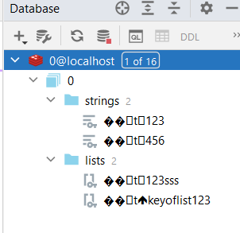

# A demo project about Redis integrated with SpringMVC and with 2 microservices 

https://docs.spring.io/spring-data/redis/reference/redis/getting-started.html

Redis - FANOUT pattern by default - i.e. to all subscribers and not bindings (based on keys) taken into account 

### I. First you should install Redis server locally or you can run it also in docker container - for Windows OS better use the docker container. I have used the docker-compose option.
- https://redis.io/docs/latest/operate/oss_and_stack/install/install-redis/
- https://hub.docker.com/_/redis
- https://redis.io/learn/operate/orchestration/docker

- **docker-compose up -d**  - in the main folder of the project run the container in a detached state
- **docker ps** - see the container running
- **docker exec -it <redis_container_id> sh** - execute interactively the container shell
- **redis-cli** - load the Redis command line interface
- **check the connection**
`127.0.0.1:6379> ping -> PONG`
`127.0.0.1:6379> set Pesho 5 -> OK`
`127.0.0.1:6379> get Pesho -> "5"`
- **AUTH mypass** - authorizing the Redis CLI
- **monitor** - monitor Redis operations on the Redis CLI
- you can stop the container but keep the existing data with **docker-compose down**
- you can stop the container and erase data entered so far with **docker-compose down --volumes**

### II. When on sharedlibrary dir, Run `gradle clean build` so that we install the sharedlibrary library jar file - `sharedlibrary-1.0-SNAPSHOT.jar`
- The **PersonDTO** should be shared in a common library in order to escape the **java.lang.ClassNotFoundException**:
- The Redis object classes (e.g., **PersonDTO**) need to be defined in a shared module or library that is accessible to both microservices. This ensures that the class definitions are available during deserialization.

### III. Check if PersonDTO is imported correctly into RedisApp1 and RedisApp2. Then run RedisApp1 (on port 8080) and RedisApp2 (on port 8081)

### IV. Redis Value Cache Service on both RedisApp1 (on port 8080) and RedisApp2 (on port 8081)
1. On **RedisApp1** automatically this PersonDTO object is created 
`{
"id": "123",
"name": "Svilen",
"age": 17
}`
2. You can run on Postman GET http request `localhost:8080/redis1/123`

3. You can create another cache pair (key, value) value on Postman POST `localhost:8080/redis1` with JSON request body
`{
"id": "456",
"name": "Atanas",
"age": 16
}`
4. You can run GET `localhost:8080/redis1/456`

5. POST `localhost:8080/redis1` with JSON body
`{
"id": "456",
"name": "Atanas Varbanov",
"age": 20
}`
6. You can run GET `localhost:8080/redis1/456` to see the changes about Person with id 456.

7. Run DELETE `localhost:8080/redis1/456`
8. Run GET `localhost:8080/redis1/456` to see the cache pair is missing

9. Run GET on the **RedisApp2** - `localhost:8081/redis2/123`

10. Run GET on the **RedisApp2** - `localhost:8081/redis2` with JSON body
 `{
 "id": "123",
 "name": "Svilen Velikov",
 "age": 23
 }`
11. Run GET on the **RedisApp2** - `localhost:8081/redis2/123` to see the changes about Person with id 123. 
12. Run GET on the RedisApp1 - `localhost:8080/redis1/123` to see the changes about Person with id 123.

### V. Redis List Cache Service on both RedisApp1 (on port 8080) and RedisApp2 (on port 8081)
1. Create cache pair (key, list) on the **RedisApp1** with http POST `localhost:8080/redis1/list/listkey` and JSON request body
`[`
   `{
   "id": "1_id",
   "name": "Atanas 18",
   "age": 18
   },
   {
   "id": "2_id",
   "name": "Atanas 19",
   "age": 19
   },
   {
   "id": "3_id",
   "name": "Atanas 20",
   "age": 20
   },
   {
   "id": "4_id",
   "name": "Atanas 21",
   "age": 21
   },
   {
   "id": "5_id",
   "name": "Atanas 22",
   "age": 22
   }`
`]`
2. Run GET on `localhost:8080/redis1/list/listkey` and you will get all the elements in the list with key `listkey`, starting by default from Redis index "0" till index "-1"(the last element).

Beware that for the user we have adjusted the controller query params (representing those Redis list indexes) to start from 1 instead of from 0!

Note that the result is reversed as we are adding with leftPush - people with ids "5_id", "4_id", "3_id", "2_id", "1_id", respective Redis indexes 0 1 2 3 4 5, and respective query params 1 2 3 4 5:
`[`
`{
   "id": "5_id",
   "name": "Atanas 22",
   "age": 22
   },
   {
   "id": "4_id",
   "name": "Atanas 21",
   "age": 21
   },
   {
   "id": "3_id",
   "name": "Atanas 20",
   "age": 20
   },
   {
   "id": "2_id",
   "name": "Atanas 19",
   "age": 19
   },
   {
   "id": "1_id",
   "name": "Atanas 18",
   "age": 18
}`
`]`
3. Running GET on `localhost:8080/redis1/list/keyoflist123?from=2&to=4` will return people with ids "4_id", "3_id", "2_id", respective Redis indexes 1, 2, 3 and respective query params 2, 3, 4
`[
   {
   "id": "4_id",
   "name": "Atanas 21",
   "age": 21
   },
   {
   "id": "3_id",
   "name": "Atanas 20",
   "age": 20
   },
   {
   "id": "2_id",
   "name": "Atanas 19",
   "age": 19
   }
]`

4. Get the last right element by also removing it - run `localhost:8080/redis1/list/last/listkey` will return the following JSON response body
`{
   "id": "1_id",
   "name": "Atanas 18",
   "age": 18
}`
5. After that, running again GET on `localhost:8080/redis1/list/listkey` will return 4 elements in total instead of 5 - the person with "1_id" was deleted.

7. About the trim operation, run DELETE on `localhost:8080/redis1/list/listkey?from=1&to=2` - this will preserve people with "5_id" and "4_id", Redis indexes 0, 1, and query params 1, 2.
8. So people with "3_id" and "4_id" will also be deleted. You can check by running GET on `localhost:8080/redis1/list/listkey` - the result response JSON body is:
`[
   {
   "id": "5_id",
   "name": "Atanas 22",
   "age": 22
   },
   {
   "id": "4_id",
   "name": "Atanas 21",
   "age": 21
   }
]`

9. If you want to delete the whole pair(key-list), you can run DELETE on `localhost:8080/redis1/list/deep/listkey`

10. Same operations about GET, POST and DELETE http requests you may also run on the **RedisApp2** on `localhost:8081/redis2/list*****` without any problem - at any time and step!

### VI. The database of Redis would look like this in the IntelliJ db plugin 

### V. Distributed locker demo
1. If we want to lock a specific Redis key for a certain amount of time before we delete that Redis key
2. We have 3 workers in the PlaygroundService trying to insert same Redis key asynchronously
3. If we disable the releaseLock (aka not deleting the Redis pair with that key), then only first worker succeeds
   - `[onPool-worker-1] c.demo.redis1.service.PlaygroundService  : Task result : '1' -> exception : 'false'`
   - `[onPool-worker-3] c.demo.redis1.service.PlaygroundService  : Task result : 'null' -> exception : 'true'`
   - `[onPool-worker-2] c.demo.redis1.service.PlaygroundService  : Task result : 'null' -> exception : 'true'`
   - and after the `howLongShouldLockBeAcquiredSeconds` exceeds this exception is thrown:  `java.lang.Exception: Failed to acquire lock in 5000 milliseconds`

### VI. Publish-subscribe messages on Redis - synchronous approach
1. **RedisApp1** is publisher, **RedisApp2** is subscriber/listener, channel topic is `mytopicname`
2. In Postman run POST http request on **RedisApp1** `localhost:8080/redis1/publish` with request body 
`{
   "data": "Hello Worlds",
   "author": "Svilen"
}`
3. When in advance you have run MONITOR in the Redis CLI, you can see this: `1726337669.034901 [0 172.18.0.1:35754] "PUBLISH" "mytopicname" "\xac\xed\x00\x05t\x00-Message{data='Hello Worlds', author='Svilen'}"`
4. In the logs of **RedisApp2** you can also see the message was received: `INFO 21528 --- [redis2] [    container-1] c.d.r.config.RedisMessageSubscriber      : Message received: �� t -Message{data='Hello Worlds', author='Svilen'}`